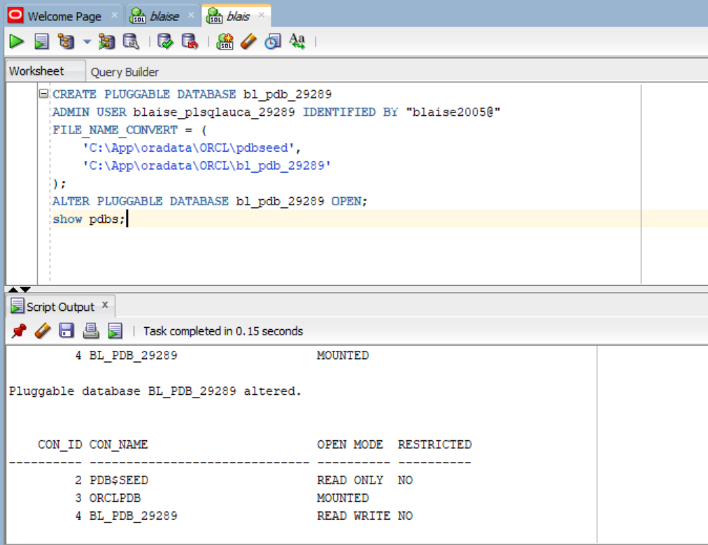
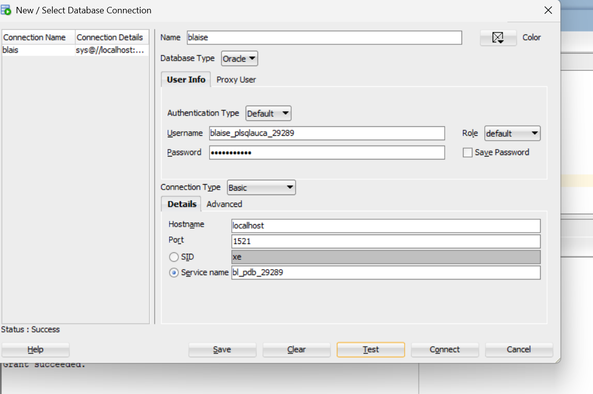
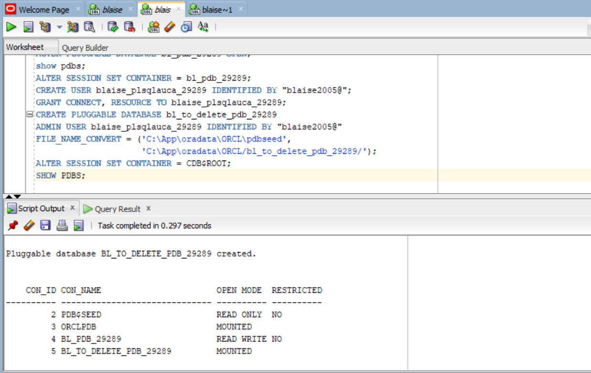
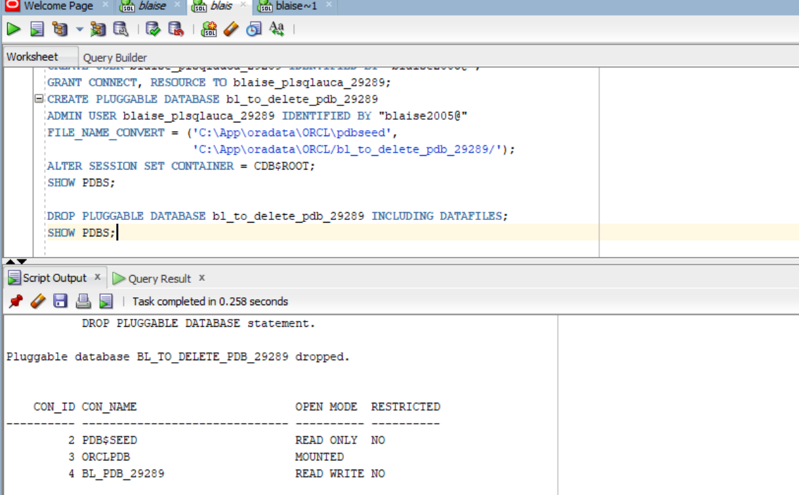
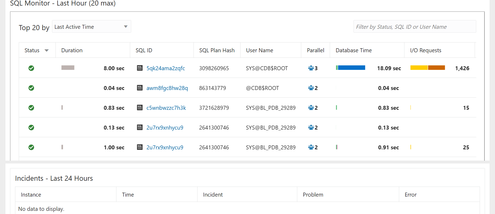

# Oracle PDB Management — Individual Assignment II

## Overview of Tasks

This assignment demonstrates practical skills in Oracle Multitenant Architecture using Oracle Database 21c. Four tasks were completed:

1. Created a new Pluggable Database (PDB) and a user inside it.
2. Created and deleted a temporary PDB to confirm full lifecycle management.
3. Verified Oracle Enterprise Manager (OEM) accessibility and dashboard.
4. Documented the full process in this repository with screenshot evidence.

## Oracle Environment Used

| Field | Details |
|---|---|
| Oracle Database | Oracle Database 21c |
| Feature | Multitenant Architecture (CDB/PDB) |
| Management Tool | Oracle Enterprise Manager (OEM) |
| Access | SQL Command Line (SQL*Plus) / SQL Developer |

## Task 1: Create a New Pluggable Database

- **PDB name:** `bl_pdb_29289`
- **User created inside PDB:** `Blaise_plsqlauca_29289`
- The PDB was created successfully, opened, and the user was created inside it.

**Evidence:**

## Task 2: Create and Delete a PDB

- **Temporary PDB name:** `bl_to_delete_pdb_29289`
- The temporary PDB was created, verified to exist, then dropped and confirmed removed.

**Evidence:**

## Task 3: Oracle Enterprise Manager (OEM)

- OEM is accessible and the dashboard reflects the Oracle environment and completed PDB tasks, with username visible.

**Evidence:**

## Challenges Faced and Solutions

_Replace this section with any issues you encountered (e.g., privileges, open state, naming conflicts) and how you solved them. If none, state "No significant challenges encountered."_

## Integrity Statement

I confirm that all work in this repository, including commands, executions, and screenshots, was completed individually by me and reflects my own execution. No commands, screenshots, or solutions were copied from classmates or generated by AI tools.

## Submission Details

- **Repository Link:** [Paste your public GitHub repository URL here]
- **PDB Name Created:** `bl_pdb_29289`
- **Issues Encountered:** [Yes/No]